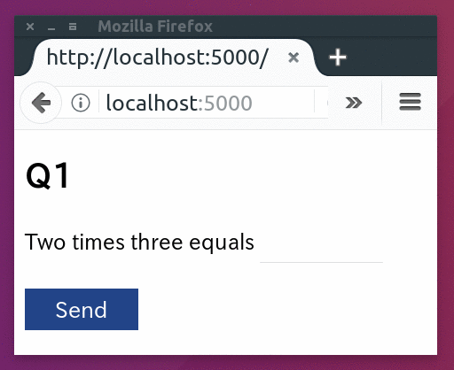

# giftplayer, a handy GIFT quiz player

Gift format is a text format for quiz [document](https://docs.moodle.org/23/en/GIFT_format) of Moodle CMS.

`giftpalayer` is a quick checking tool for quiz written in Gift format.

Usage 1: Generate a HTML document for a given Gift quiz.

```sh
$ echo '::Q1:: Two times three equals {=six =6}' | python3 -m giftplayer.run - | bcat
```

Here, [bcat](https://rtomayko.github.io/bcat/) is a HTML viewer (if you are using Ubuntu, it can be installed with `apt install ruby-bcat`).

Usage 2: Run a web server for a given Gift quiz.

```sh
$ echo '::Q1:: Two times three equals {=six =6}' | python3 -m giftplayer.run -w -
```



## Installation

To install, clone the repository & run setup.py

```sh
$ git clone https://github.com/tos-kamiya/giftplayer
$ cd giftplayer
$ sudo python3 setup.py install
```

To check the installation, run it without any arguments.
It will show a html text generated from a sample Gift file.

```sh
$ python3 -m giftplayer.run -w
> No gift_script is given. Use sample.gift.

<!DOCTYPE html>
<html>
....
```

## Supported rules of GIFT syntax

See [sample.gift](giftplay/sample.gift).

Supported:

* true/false
* multiple choice
* fill-in-the-blank
* matching
* math range
* math range specified with interval end points
* essay
* multiple choice with multiple right answers

Not yet supported:

* multiple numeric answers

## License

BSD-3-Clause, except for an enclosed `jquery-*.js` file.
